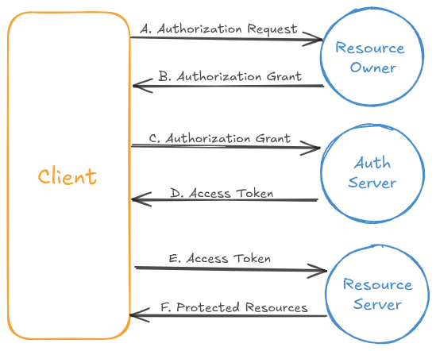

# **Introduction to OAuth 2.0**

When you use web services, sharing your username and password with third-party applications is risky:

* It grants **full, unrestricted access**, not just to the part you want to share.
* It requires the third party to **store your credentials**, which can be stolen, leaked, or misused.

**OAuth 2.0** solves this problem by introducing an **[authorization](./authentication-vs-authorization.md) layer**. Instead of handing over your credentials, you allow a third party to act on your behalf with a **limited permission token**.

---

## **The Core Idea**

OAuth 2.0 enables a **third-party application** to access resources **on behalf of the resource owner** within limits that the owner explicitly approves.

Instead of credentials, the application receives an **access token**:

* Tokens are temporary and can expire.
* Tokens only allow actions the user has consented to.
* Tokens must be sent over **[HTTP](/docs/fundamentals/http.md)/[HTTPS](/docs/fundamentals/https.md)**, usually in the `Authorization` header.

This keeps your credentials safe while still allowing controlled access.

---

## **Key Roles in OAuth 2.0**

1. **Resource Owner**
   The person who owns the data (e.g., you and your photos).

2. **Resource Server**
   The server hosting the protected data (e.g., the photo website storing your albums).

3. **Client Application**
   The third-party application requesting access (e.g., a photo editor that wants to import your public album).

4. **Authorization Server**
   The system that authenticates the resource owner and issues **access tokens**.
   *Note: In practice, the resource server and authorization server may run on the same system.*

---

## **How OAuth 2.0 Works**

At a high level:

1. The **client application** asks for authorization to access a resource.
2. The **authorization server** authenticates the resource owner and confirms what access should be granted.
3. If approved, the **authorization server** issues an **access token** to the client.
4. The client sends the token to the **resource server** to gain access, but only within the approved scope.

---

## **Example Scenario**

Imagine a photo-sharing website:

* You have two folders: one for **public photos** and one for **private photos**.
* Normally, access requires your **username and password**.
* If you gave those credentials to a third-party app, it could see *everything* — both public and private.

With OAuth:

* The photo editor app requests permission.
* You grant access **only to your public photos**.
* The authorization server issues an **access token** restricted to that scope.
* The photo editor can now load your public photos but cannot touch your private ones.

---

## **OAuth 2.0 Protocol Flow**

The diagram above shows the sequence of interactions in a typical OAuth 2.0 exchange:

1. **Authorization Request (A)**  
   The client application redirects the resource owner (user) to the authorization server, asking for permission to access specific resources.  

2. **Authorization Grant (B → C)**  
   If the user approves, the authorization server issues an **authorization grant** (often an authorization code).  
   - This grant is a temporary credential representing the user’s consent.  
   - It does not expose the user’s username or password to the client.  

3. **Access Token Request (D)**  
   The client sends the authorization grant to the authorization server, authenticating itself in the process.  
   The authorization server validates the grant and issues an **access token**.  
   - The token encodes the permissions (scope) and is usually short-lived.  

4. **Accessing Resources (E → F)**  
   The client includes the access token when calling the resource server.  
   The resource server verifies the token with the authorization server and, if valid, returns the requested **protected resources**.  

---

This structured flow ensures:  
- The client never handles the user’s credentials directly.  
- Tokens can be **scoped** (limiting access to certain actions or data) and **temporary** (reducing security risks).  
- The authorization server is the central authority that enforces policies and trust.  

---

## **Authorization Grant Types**

OAuth 2.0 defines several ways (known as **grant types**) for a client to obtain an access token.  
Each grant type fits different application scenarios:

1. **Authorization Code Grant**  
   *Most common and secure.*  
   - The client redirects the resource owner to the authorization server.  
   - After successful [authentication](./authentication-vs-authorization.md), the authorization server returns an **authorization code**.  
   - The client exchanges this code for an **access token**.  
   - Best suited for server-side and mobile apps where tokens should not be exposed in URLs.  

2. **Implicit Grant**  
   - Designed for browser-based (JavaScript) apps.  
   - The access token is returned **directly in the URL fragment** after authorization.  
   - Simpler but less secure, since the token is exposed in the browser.  
   - Rarely recommended today; replaced by more secure approaches like **PKCE** (Proof Key for Code Exchange).  

3. **Resource Owner Password Credentials (ROPC) Grant**  
   - The resource owner provides their **username and password** directly to the client.  
   - The client sends these credentials to the authorization server to obtain an access token.  
   - Useful in trusted scenarios, but risky because credentials are shared with the client.  

4. **Client Credentials Grant**  
   - No resource owner involvement.  
   - The client authenticates with the authorization server using its **own credentials** and receives an access token.  
   - Typically used for machine-to-machine (M2M) communication (e.g., background services, cron jobs).  

---

## **Access and Refresh Tokens**

Once a grant is approved, the client receives an **access token**.  

- **Access Token**  
  - A string (often a long, opaque value or JWT) that represents the client’s permission to access resources.  
  - Short-lived: expires after a set time.  
  - Sent in requests (commonly in the `Authorization: Bearer <token>` header).  

- **Refresh Token**  
  - A long-lived credential that can be exchanged for a new access token once the old one expires.  
  - Reduces the need for the user to reauthorize frequently.  
  - Must be stored securely, since it allows ongoing access.  

Together, access and refresh tokens enable secure, time-limited access to resources without repeatedly asking the user to log in.

---

